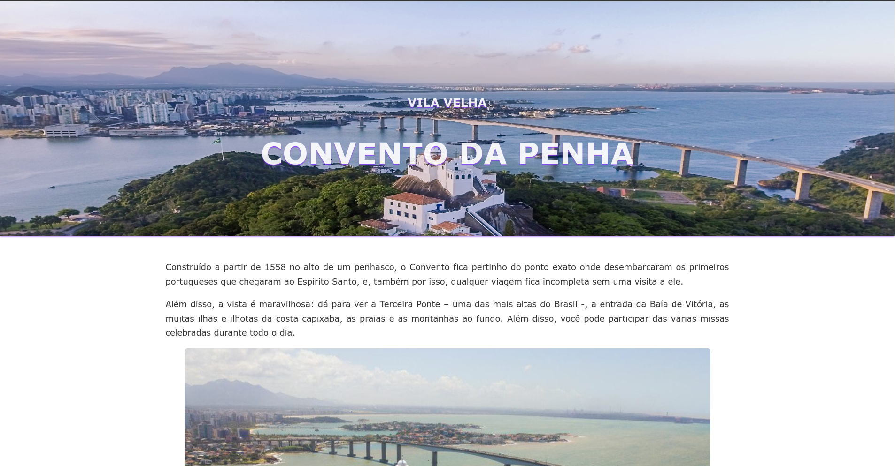

# Guia-Ponto-Turistico-HTML-CSS

Projeto criado em HTML e CSS.

Projeto de `landing page responsiva` para divulgar um ponto turístico.

Disciplina: Ferramentas de Desenvolvimento Web (10700010058_20242_01)

## Proposta:

Crie uma página em HTML e CSS divulgando um ponto turístico que você mais gosta e
convidando os leitores do site a conhecê-lo. Insira vídeos, imagens e personalize o seu
projeto para torná-lo atrativo e informativo.

Requisitos do Projeto:

1. HTML:
   oCrie uma estrutura de página completa utilizando tags HTML apropriadas.
   oInclua cabeçalhos, parágrafos, listas, links, imagens e vídeos.
   oUse tags semânticas para melhorar a acessibilidade e SEO.

2. CSS:
   oPersonalize o layout e o estilo da página utilizando CSS.
   oInclua regras de estilo para diferentes elementos HTML.
   oUtilize cores, fontes, margens, paddings e outros recursos de design para
   tornar a página visualmente atraente.

3. Estrutura da Página:
   oA página deve ter uma estrutura clara e organizada.
   oInclua um cabeçalho com o título do ponto turístico.
   oAdicione uma seção principal com uma descrição detalhada do ponto
   turístico, incluindo imagens e vídeos.
   oInsira uma seção de rodapé com informações adicionais e créditos.

## Executando o projeto

Para clonar o projeto, execute no terminal ou prompt o comando abaixo dentro do diretório padrão do servidor http da sua escolha:

`git clone git@github.com:manoelps/Guia-Ponto-Turistico-HTML-CSS.git`

## Navegando

Agora o seu navegador e acesse a url correspondente ao projeto para verificar o funcionamento.

## Screenshot

